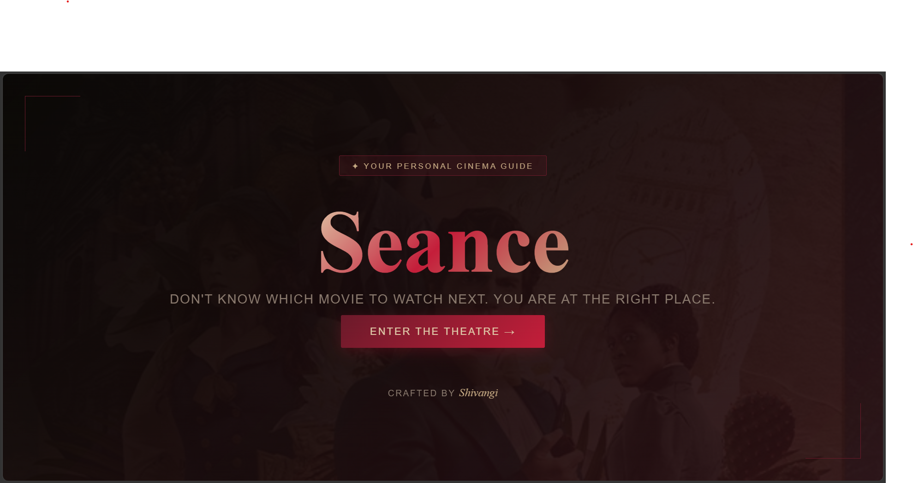

# seance
 A cinematic movie recommendation Website built with HTML, CSS &amp; JavaScript using the TMDB API.

Séance is a dark, elegant movie discovery app built with vanilla HTML, CSS and JavaScript. It pulls live data from the TMDB API and lets you explore, filter, and save movies you'll actually feel.
---
## ✨ Features

- 🔍 Search any movie instantly
- 🎭 Filter by genre - Action, Comedy, Drama, Horror, Romance, Sci-Fi and more
- 📊 Switch between Popular, Trending and Top Rated
- ⭐ Filter by minimum rating using a slider
- 🎨 Popup background color auto-extracted from movie poster using ColorThief
- ♥ Save movies to your personal watchlist
- 💾 Watchlist saved to browser so it persists after refresh

---

## 🛠️ Built With

- HTML5
- CSS3 (Flexbox, Grid, CSS Variables)
- Vanilla JavaScript (Fetch API, async/await, DOM manipulation)
- [TMDB API](https://www.themoviedb.org/) — for live movie data
- [ColorThief](https://lokeshdhakar.com/projects/color-thief/) — for poster color extraction
- [Google Fonts](https://fonts.google.com/) — Playfair Display & Inter

---

## 🚀 Live Demo

👉 [seance.live](https://shivangi-kotnala.github.io/seance)

---

## 📸 Preview



---

## 🔧 How to Run Locally

1. Clone the repo
```bash
   git clone https://github.com/yourusername/seance.git
```
2. Open the folder in VS Code
3. Right click `index.html` → Open with Live Server

No installs needed. No frameworks. Pure HTML, CSS and JS.

---
📌 [GitHub](https://github.com/shivangi-kotnala)

---

*This product uses the TMDB API but is not endorsed or certified by TMDB.*
